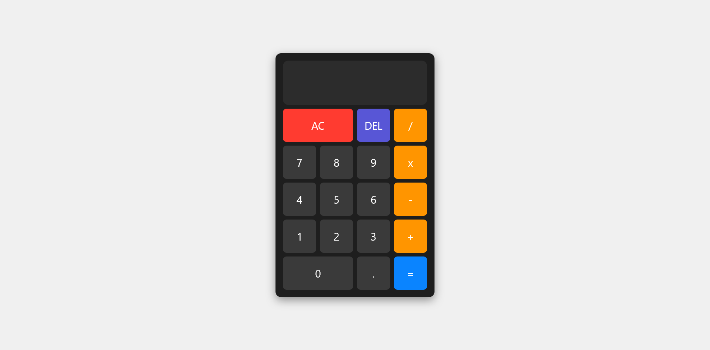

# JavaScript Web Calculator App
A clean, responsive web calculator built with vanilla JavaScript. This project focuses on providing a stable user interface and professional-grade math handling, including automatic formatting and scientific notation for large results.

## Table of Contents

- [Overview](#overview)
  - [The Project](#the-project)
  - [Core Features](#core-features)
  - [Screenshot](#screenshot)
  - [Links](#links)
- [Technical Process](#technical-process)
  - [Tech Stack](#tech-stack)
  - [Key Technical Challenges](#key-technical-challenges)
  - [Future Roadmap](#future-roadmap)
- [Contact](#contact)

## Overview

### The project

I built this calculator to practice Object-Oriented Programming (OOP) in JavaScript. The goal was to create a tool that didn't just perform math, but felt like a real application—handling edge cases like division by zero and extremely large numbers that would normally break a web layout.

### Core Features

* **Standard Arithmetic:** Supports addition, subtraction, multiplication, and division.
* **Smart Formatting:** Numbers are automatically formatted with commas (e.g., `1,500,000`) for better readability using `.toLocaleString()`.
* **Overflow Protection:** If a result exceeds 12 digits, the app automatically converts the display to **Scientific Notation** to prevent layout breaking.
* **Responsive Keypad:** A mobile-first design using CSS Grid for a tactile, app-like experience.

### Screenshot



### Links

- [Solution URL](https://github.com/Kking927/calculator)
- [Live Site URL](https://kking927.github.io/calculator/)

## Technical Process

### Tech Stack

* **HTML5**
* **CSS3**
* **JavaScript (ES6+)**

### Key Technical Challenges

#### 1. Managing UI Stability (The "Jumping" Problem)
Initially, long numbers caused the calculator display to wrap to a second line, which pushed the buttons down and broke the layout. I solved this by:
* Locking the grid row heights in CSS.
* Implementing `white-space: nowrap` and `overflow: hidden` on the display container.

#### 2. Dynamic Number Scaling
To handle massive mathematical results, I wrote a custom `getDisplayNumber` method. It checks the length of the string and determines if the value should be presented as a standard formatted number or converted via `.toExponential(5)`.

```javascript
getDisplayNumber(number) {
  const stringNumber = number.toString();
  if (stringNumber.length > 12) {
    return parseFloat(stringNumber).toExponential(5);
  }
  return parseFloat(stringNumber).toLocaleString('en');
}
```

### Future Roadmap

* **Keyboard Support:** Adding event listeners for physical numpad input.

* **Theme Toggle:** Implementing a Dark/Light mode switch.

* **History Feature:** A slide-out panel to view previous calculations.

## Contact

- GitHub - [@Kking927](https://github.com/Kking927)
